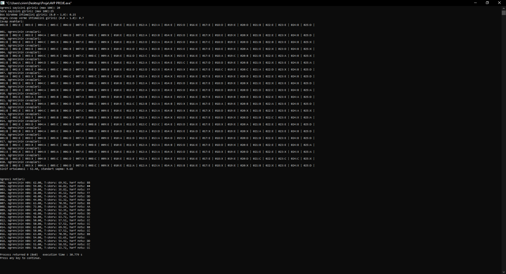

# Sınav Simülatörü

Bu proje, maksimum 100 öğrenci için çalışacak bir **Sınav Simülatörü**dür. Proje, iki ana modülden oluşmaktadır:

1. **Sınav Üreteci:** Çoktan seçmeli bir sınav üretir ve öğrencilere uygular.
2. **Sınav Değerlendirici:** Öğrencilerin sınav sonuçlarını değerlendirir ve başarı düzeylerini hesaplar.

## Özellikler

### Sınav Üreteci
- Öğrenci sayısını (N), soru sayısını (S), boş bırakılma ihtimalini (B) ve doğru cevaplanma ihtimalini (D) kullanıcıdan alır.
- Çoktan seçmeli bir cevap anahtarı (A, B, C, D, E) oluşturur.
- Öğrencilerin cevaplarını simüle eder ve bir matriste saklar.
- Zorunlu fonksiyonlar:
  1. `void cevap_anahtari_uret(char cevap_anahtari[], int S)`
  2. `void cevap_anahtari_yazdir(char cevap_anahtari[], int S)`
  3. `void sinavi_uygula(char ogrenci_cevaplari[][100], char cevap_anahtari[], int N, int S, double B, double D)`
  4. `void ogrenci_cevabini_yazdir(char ogrenci_cevaplari[][100], int ogrenci_ID, int S)`

### Sınav Değerlendirici
- Her öğrenci için Ham Başarı Notu (HBN) hesaplar. (4 yanlış 1 doğruyu götürür.)
- Sınıf ortalaması, standart sapma ve T skorlarını hesaplar.
- Başarı düzeyini ve harf notlarını belirler.
- Zorunlu fonksiyonlar:
  1. `void ogrencileri_puanla(char ogrenci_cevaplari[][100], char cevap_anahtari[], double HBN[], int N, int S)`
  2. `double sinif_ortalamasi_hesapla(double HBN[], int N)`
  3. `double standart_sapma_hesapla(double ortalama, double HBN[], int N)`
  4. `void T_skoru_hesapla(double ortalama, double HBN[], int N, double std, double T_skoru[])`

## Nasıl Çalışır?

1. **Sınav Üreteci Modülü:**
   - Kullanıcıdan parametreleri alır ve bir cevap anahtarı oluşturur.
   - Öğrencilerin cevaplarını simüle eder ve bunları matriste saklar.
   - Öğrencilerin cevaplarını istenildiğinde konsola yazdırır.

2. **Sınav Değerlendirici Modülü:**
   - Öğrencilerin cevaplarını ve cevap anahtarını karşılaştırarak HBN değerlerini hesaplar.
   - Sınıfın başarı düzeyini belirler.
   - Öğrencilerin T skorlarını ve harf notlarını hesaplar.

## Gereksinimler
- Bir C derleyicisi (örn. GCC, Clang veya C'yi destekleyen herhangi bir IDE).

## Kurulum ve Çalıştırma
1. Bu depoyu klonlayın:
   ```bash
   git clone https://github.com/ncrim7/exam-simulator.git
   ```
2. Proje dizinine gidin:
   ```bash
   cd exam-simulator
   ```
3. Projeyi derleyin:
   ```bash
   gcc -o exam_simulator main.c
   ```
4. Uygulamayı çalıştırın:
   ```bash
   ./exam_simulator
   ```

## Proje Yapısı
- `main.c`: Sınav üreteci ve sınav değerlendirici modüllerini içeren ana dosya.
- `README.md`: Proje dokümantasyonu.

## Katkı Sağlama
Katkılara açık! Bu depoyu fork'layabilir, değişikliklerinizi yapabilir ve bir pull request gönderebilirsiniz.

## Görseller
Aşağıda proje ile ilgili bir görsel bulunmaktadır:



